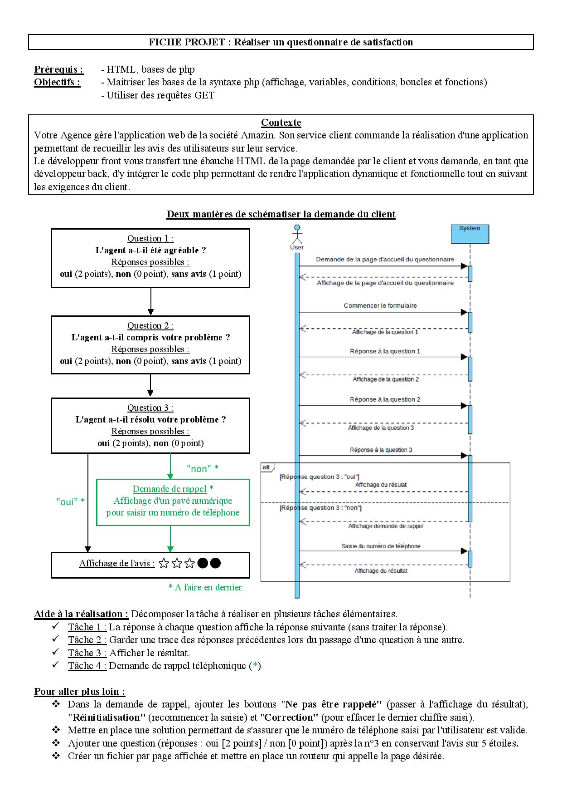

# Table of Contents 
- [Project-Specification](#Project-Specification) 
- [Pre-requisites](#Pre-requisites) 
- [How-to-use-it](#How-to-use-it) 
- [Some-Screenshots](#Some-Screenshots) 

# Project-Specification


# Pre-requisites
HTML5 and PHP7

# How-to-use-it
- From root repo, lanch your PHP server:<br>
```shell
php -S localhost:8000
```
- and using your browser goto: localhost:8000
- Or clone this repo in "www" repo of your WampServer and go to this path using your localhost path

# Some-Screenshots
- Start  

- Question 1  

- Question 2  

- Question 3  

- In case Question 3 was answered "OUI"  

- In case Question 3 was answered "NON", you will have possibiliy to add your phone number, number you are clicking will be prompt, you have possibility
to correct the number or reset all numbers. Your given phone number will be checked when you validate, in case the phone number doesn't contain 10 numbers you will have 
a new page saying "please correct your number". In this page you also gave possibility to skip the callback, then the notation page will apear. You also have possibility
to retry the questionnary.  


